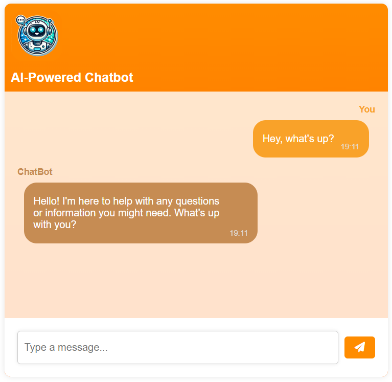

# AI-Powered Chatbot 🤖💬

## Overview
This is an AI-powered chatbot built with Node.js and OpenAI's API. The chatbot provides intelligent responses to user inputs and can be easily integrated into web applications.

## Features
- AI-driven responses using OpenAI's API
- Utilizes GPT-4o for intelligent interactions
- Web-based frontend for user interaction
- Node.js backend with Express.js
- Simple configuration and easy deployment

## Screenshot


## Project Structure
```
AI-Powered-Chatbot/
├── package.json              # Project dependencies
├── package-lock.json         # Dependency lock file
├── config.js                 # Configuration file
├── openai.js                 # OpenAI API integration
├── server.js                 # Backend server
├── dockerfile                # Docker configuration
├── public/
│   ├── chat.png              # Chatbot UI asset
│   ├── index.html            # Web frontend
│   ├── main.js               # Client-side logic
│   ├── style.css             # Stylesheet
```

## Installation
### Prerequisites
- Node.js installed on your machine
- OpenAI API key

### Steps
1. Clone this repository:
   ```sh
   git clone https://github.com/Markz88/AI-Powered-Chatbot.git
   cd AI-Powered-Chatbot
   ```
2. Install dependencies:
   ```sh
   npm install
   ```
3. Configure your OpenAI API key in `config.js`:
   ```js
   module.exports = {
       OPENAI_API_KEY: "your-api-key-here"
   };
   ```
4. Start the server:
   ```sh
   node server.js
   ```
5. Open `http://localhost:3000` in your browser to interact with the chatbot.

## Usage
- Start a conversation by typing a message in the chat interface.
- The chatbot will process your input and respond intelligently.

## Deployment
### Deploy with Docker
You can run the chatbot using Docker:
1. Build the Docker image:
   ```sh
   docker build -t chatbot .
   ```
2. Run the Docker container:
   ```sh
   docker run -p 3000:3000 chatbot
   ```
3. Open `http://localhost:3000` in your browser.

### Deploy on a Cloud Server (e.g., Heroku, Vercel, AWS)
1. Set up your environment variables for the OpenAI API key.
2. Use a process manager like **PM2** for stability:
   ```sh
   npm install -g pm2
   pm2 start server.js
   ```

## License
This project is available under the MIT License.